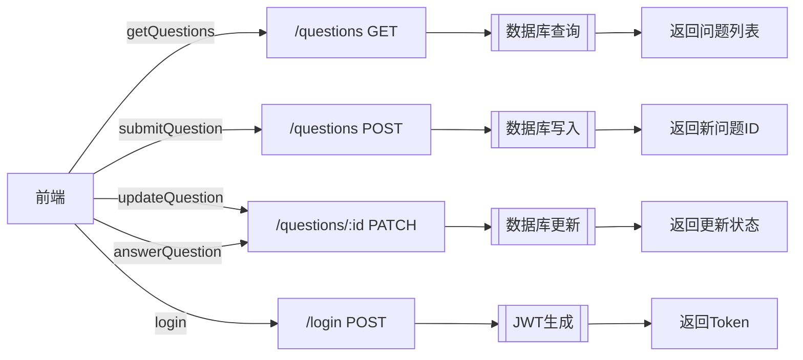

# API 接口文档

## API 调用流程图

## 后端 API 列表

| 接口路由               | 方法   | 功能                     | 代码模块          |
|------------------------|--------|--------------------------|-------------------|
| `/`                   | GET    | 后端健康检查             | `src/app.ts`      |
| `/health`             | GET    | 系统健康检查             | `src/app.ts`      |
| `/questions`          | GET    | 获取所有问题             | `src/app.ts`      |
| `/questions/:id`      | PATCH  | 更新问题状态/答案        | `src/app.ts`      |
| `/questions`          | POST   | 提交新问题               | `src/app.ts`      |
| `/auth/challenge`     | GET    | 获取认证挑战             | `src/app.ts`      |
| `/login`             | POST   | 用户登录                 | `src/app.ts`      |
| `/profile`           | GET    | 获取用户资料(需认证)      | `src/app.ts`      |

## 前端 API 服务

| 服务方法               | 对应后端API           | 功能                     | 代码模块          |
|------------------------|-----------------------|--------------------------|-------------------|
| `getQuestions()`      | `/questions GET`      | 获取问题列表             | `apiService.ts`   |
| `submitQuestion()`    | `/questions POST`     | 提交新问题               | `apiService.ts`   |
| `updateQuestion()`    | `/questions/:id PATCH`| 更新问题状态/答案        | `apiService.ts`   |
| `answerQuestion()`    | `/questions/:id PATCH`| 回答问题                 | `apiService.ts`   |
| `login()`             | `/login POST`         | 用户登录                 | `apiService.ts`   |

[返回项目规范文档](./ProjectRule.md)