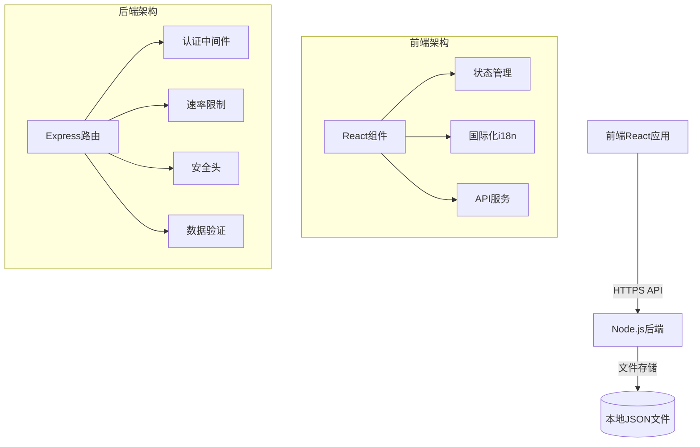

# Q&A Live 系统架构文档

## 1. 系统概述
Q&A Live 是一个全栈应用，包含 React 前端和 Node.js 后端，采用JSON文件存储的轻量级架构设计。

## 2. 技术栈

### 前端技术栈
- **框架**: React 18
- **构建工具**: Vite 5
- **状态管理**: React Hooks
- **UI 组件**: Lucide React
- **国际化**: i18next
- **样式**: TailwindCSS
- **开发工具**: TypeScript 5

### 后端技术栈
- **框架**: Express 4
- **语言**: TypeScript 4
- **认证**: JWT + bcryptjs
- **安全**: Helmet + express-rate-limit
- **数据存储**: JSON文件
- **开发工具**: ts-node-dev

## 3. 系统架构图

## 4. 模块划分

### 前端模块
- 用户界面组件
- 国际化模块
- 二维码生成模块
- 状态管理

### 后端模块
- API 路由
- 认证服务
- JSON数据管理
- 限流中间件

## 5. 部署架构
- 支持独立部署
- 轻量级部署，无需容器化
- 直接运行Node.js服务

## 6. 开发环境
- 使用 concurrently 同时运行前后端
- 热重载开发模式
- 集成测试框架

## 7. 安全考虑
- 前端: CSP 策略
- 后端: Helmet 安全头
- 认证: JWT + 速率限制
- 数据: bcrypt 哈希存储

## 8. 扩展性设计
- 组件化前端架构
- 微服务后端设计
- 清晰的接口定义
- 模块化代码结构