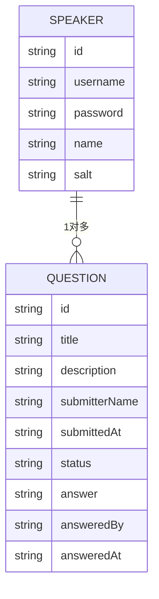

# 数据模型与关系文档

## 核心数据模型

### 用户模型 (Speaker)
```typescript
interface Speaker {
  id: string;          // 用户唯一ID
  username: string;     // 用户名
  password: string;     // 加密后的密码(SHA-256 + salt)
  name: string;        // 显示名称
  salt: string;        // 密码盐值
}
```

### 问题模型 (Question)
```typescript
interface Question {
  id: string;          // 问题ID
  title: string;       // 问题标题
  description: string; // 问题描述
  submitterName: string; // 提交者名称
  submittedAt: string;  // 提交时间(ISO格式)
  status: 'pending' | 'answered' | 'closed'; // 状态
  answer?: string;     // 答案
  answeredBy?: string; // 回答者
  answeredAt?: string; // 回答时间(ISO格式)
}
```


## 数据关系



## 数据流向

1. **用户认证流程**:
   - 前端 → 认证中间件 → JSON文件验证 → JWT生成
2. **问题提交流程**:
   - 前端 → 速率限制 → JSON文件写入
3. **问题回答流程**:
   - 管理员 → 认证中间件 → JSON文件更新

## 安全策略
- **密码安全**:
  - SHA-256哈希 + 随机盐值
  - 前端哈希 + 后端二次哈希
- **会话管理**:
  - JWT令牌(24小时有效期)
- **请求限制**:
  - 登录限速(15分钟5次)
  - 通用限速(15分钟100次)

## 数据验证
- 用户输入: Joi schema验证
- API参数: Express-validator

## 安全考虑
- 密码: bcrypt哈希存储

[返回项目规范文档](./ProjectRule.md)
        string status
        string authorId
        string answer
        date answeredAt
        date createdAt
        date updatedAt
    }
```

## 数据流向

1. **用户注册流程**:
   - 前端 → 后端 → MongoDB (用户集合)
2. **问题提交流程**:
   - 前端 → 后端 → MongoDB (问题集合)
3. **问题回答流程**:
   - 管理员 → 后端 → MongoDB (更新问题状态)

## 缓存策略
- 热门问题: Redis 缓存
- 用户会话: JWT + Redis

[返回项目规范文档](./ProjectRule.md)