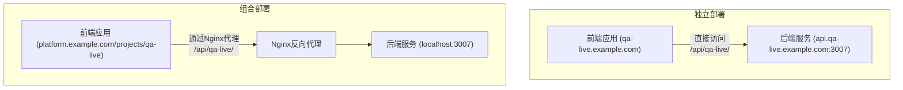

# 项目部署结构文档

## 1. 部署模式概述

本项目支持两种部署模式：

1. **独立部署模式 (Standalone Deployment)**
   - 前后端完全独立部署
   - 适合独立域名或子域名部署
   - 使用根路径 (/) 作为基础路径

2. **组合部署模式 (Combined Deployment)**
   - 前后端部署在同一域名下
   - 使用 `/projects/qa-live/` 作为基础路径
   - 适合作为大型平台的一部分部署

## 2. 部署架构图

## 3. 关键配置文件

### 3.1 Docker 相关文件

| 文件路径 | 用途 |
|----------|------|
| `docker-compose-standalone.yml` | 独立部署的容器编排配置 |
| `docker-compose-combined-deploy.yml` | 组合部署的容器编排配置 |
| `server/Dockerfile` | 后端服务构建配置 |
| `web/Dockerfile-standalone` | 前端独立部署构建配置 |
| `web/Dockerfile-combined-deploy` | 前端组合部署构建配置 |

### 3.2 Nginx 配置

| 文件路径 | 用途 |
|----------|------|
| `web/nginx-standalone.conf` | 独立部署的Nginx配置 |
| `web/nginx-combined-deploy.conf` | 组合部署的Nginx配置 |

### 3.3 构建配置

| 文件路径 | 用途 |
|----------|------|
| `web/vite.config.standalone.js` | 独立部署的前端构建配置 |
| `web/vite.config.prod.js` | 组合部署的前端构建配置 |

## 4. 部署流程

### 4.1 独立部署流程
1. 构建前端应用: `npm run build`
2. 构建后端服务: `npm run build`
3. 启动容器: `docker-compose -f docker-compose-standalone.yml up -d`

### 4.2 组合部署流程
1. 构建前端应用: `npm run build-combined-deploy`
2. 构建后端服务: `npm run build`
3. 启动容器: `docker-compose -f docker-compose-combined-deploy.yml up -d`

## 5. 网络架构

- **独立部署**: 前端直接访问后端API (`/api/qa-live/`)
- **组合部署**: 前端通过Nginx反向代理访问后端API (`/api/qa-live/`)

## 6. 环境变量

| 变量名 | 用途 | 默认值 |
|--------|------|--------|
| `NODE_ENV` | 运行环境 | `production` |
| `SERVER_PORT` | 后端服务端口 | `3007` |
| `VITE_DISABLE_SERVER` | 禁用开发服务器 | `true` |
| `LOG_LEVEL` | 日志级别 | `INFO` |

[返回项目规范文档](./ProjectRule.md)